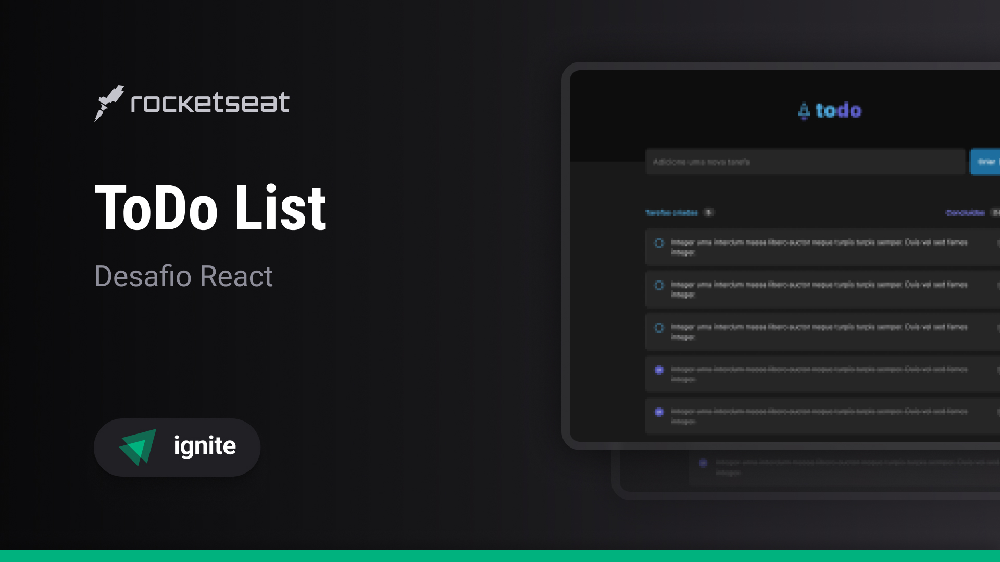

<h1 align='center'> 🚧 Ignite ToDo List API in progress... 🚧 </h1>

<div align='center'>

  
  
  [](https://opensource.org/licenses/MIT)

  [🇬🇧 English](#en) / [🇧🇷 Português](#pt-br)

</div>

## <a id='en' style='text-decoration: none; color: inherit;'>🇬🇧 English</a>

### 📚 Summary
- [❕ About](#en-about)
- [📖 Instructions](#en-instructions)
  - [📥 Install](#en-install)
  - [🚀 Run Locally](#en-locally)
- [📂 Structure](#en-structure)

#### <a id='en-about' style='text-decoration: none; color: inherit;'>❕ About</a>
This is my implementation of the challenge project "ToDo List API" from the first Node.js module of [Ignite](https://www.rocketseat.com.br/ignite), an intermediate and advanced course in various programming languages and technologies offered by [Rocketseat](https://www.rocketseat.com.br/).

#### <a id='en-instructions' style='text-decoration: none; color: inherit;'>📖 Instructions</a>
##### <a id='en-instalar' style='text-decoration: none; color: inherit;'>📥 Install</a>
Paste the 1º command into a terminal open within a folder of your preference to clone the project, then run one of the versions of the 2º command to install the dependencies
```sh
git clone https://github.com/mar-alv/ignite-todo-list-api.git
npm i # Or npm install
```

##### <a id='en-locally' style='text-decoration: none; color: inherit;'>🚀 Run Locally</a>
Paste the command into a terminal, the server will be accessable through the port 3001
```sh
npm run dev
```

#### <a id='en-structure' style='text-decoration: none; color: inherit;'>📂 Structure</a>
```
│ httpie/
│   └── ... files to easily test the endpoints from the terminal
│ src/
│   ├── middlewares/
│   │     └── ... functions to intercept and modify the requests and responses
│   ├── utils/
│   │     └── ... utils functions to deal with route and query params
│   └── ...
```

## <a id='pt-br' style='text-decoration: none; color: inherit;'>🇧🇷 Português</a>

### 📚 Sumário
- [❕ Sobre](#pt-br-sobre)
- [📖 Instruções](#pt-br-instrucoes)
  - [📥 Instalar](#pt-br-instalar)
  - [🚀 Rodar Localmente](#pt-br-localmente)
- [📂 Estrutura](#pt-br-estrutura)

#### <a id='pt-br-sobre' style='text-decoration: none; color: inherit;'>❕ Sobre</a>
Esta é a minha implementação do desafio "ToDo List API" do primeiro módulo de Node.js do [Ignite](https://www.rocketseat.com.br/ignite), um curso intermediário e avançado de diversas linguagens de programação e tecnologias oferecido pela [Rocketseat](https://www.rocketseat.com.br/).

#### <a id='pt-br-instrucoes' style='text-decoration: none; color: inherit;'>📖 Instruções</a>
##### <a id='pt-br-instalar' style='text-decoration: none; color: inherit;'>📥 Instalar</a>
Cole o 1º comando em um terminal aberto dentro de uma pasta de sua preferência para clonar o projeto, em seguida rode uma das versões do 2º comando para instalar as dependências
```sh
git clone https://github.com/mar-alv/ignite-todo-list-api.git
npm i # Ou npm install
```

##### <a id='pt-br-localmente' style='text-decoration: none; color: inherit;'>🚀 Rodar Localmente</a>
Cole o comando em um terminal, o servidor estará acessível pela porta 3001 
```sh
npm run dev
```

#### <a id='pt-br-estrutura' style='text-decoration: none; color: inherit;'>📂 Estrutura</a>
```
│ httpie/
│   └── ... arquivos para facilmente testar os endpoints pelo terminal
│ src/
│   ├── middlewares/
│   │     └── ... funções para interceptar e modificar as requisições e respostas
│   ├── utils/
│   │     └── ... funções utilitárias para lidar com parâmetros de rota e consulta
│   └── ...
```

## 🧰 Technologies
### Build Tools
[](https://nodejs.org/)

### Testing
[](https://httpie.io/)


## Author
<div style='display: flex; align-items: center;'>
    
    <div>
        <strong>Marcelo Alvarez</strong>
        <br>
        <em>Front-end Developer</em><br>
        <span>"Some AI generated funny quote here 😗"</span><br>
        <a href='https://www.linkedin.com/in/marcelo-dos-santos-alvarez-474406180/'>LinkedIn</a>
    </div>
</div>

## License
Licensed under [MIT](./LICENSE)
