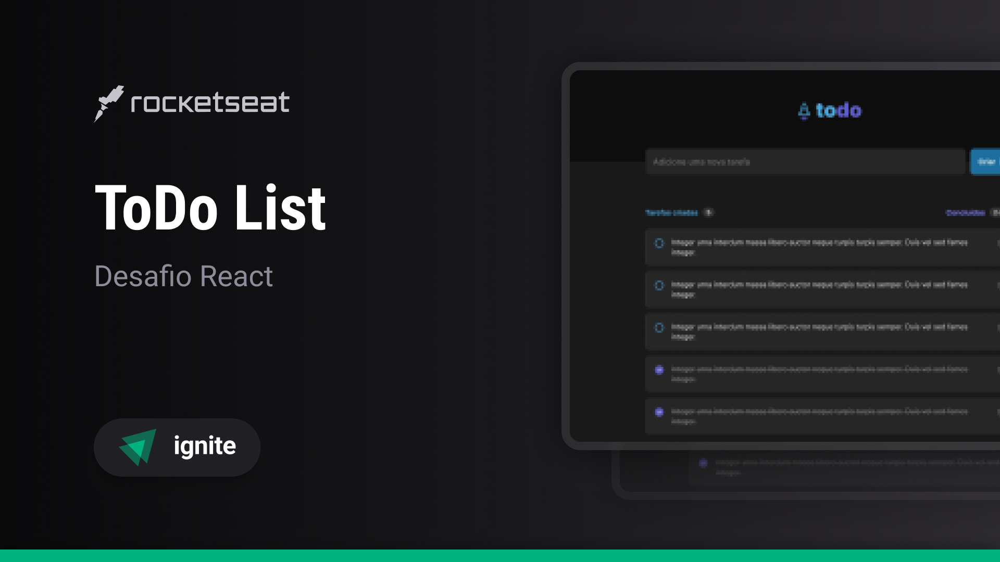

<h1 align='center'> Ignite ToDo List API </h1>

<div align='center'>

  
  
  [](https://opensource.org/licenses/MIT)

  [⬅️ Voltar](../README.md)

</div>

## 📚 Sumário
- [❕ Sobre](#about)
- [📖 Instruções](#instructions)
  - [📥 Instalar](#install)
  - [🚀 Rodar Localmente](#locally)
- [⚡ Endpoints](#endpoints)
- [📂 Estrutura](#pt-br-estrutura)
- [🧰 Tecnologias](#technologies)
- [📸 Prints e 🎥 Gravações](#screenshots-prints)
- [👤 Autor](#author)
- [📄 Licença](#license)

### <a id='about' style='text-decoration: none; color: inherit;'>❕ Sobre</a>
Esta é a minha implementação do desafio "ToDo List API" do primeiro módulo de Node.js do [Ignite](https://www.rocketseat.com.br/ignite), um curso intermediário e avançado de diversas linguagens de programação e tecnologias oferecido pela [Rocketseat](https://www.rocketseat.com.br/).

### <a id='instructions' style='text-decoration: none; color: inherit;'>📖 Instruções</a>
#### <a id='install' style='text-decoration: none; color: inherit;'>📥 Instalar</a>
Cole o 1º comando em um terminal aberto dentro de uma pasta de sua preferência para clonar o projeto
```sh
git clone https://github.com/mar-alv/ignite-todo-list-api.git
```
Em seguida rode uma das versões do 2º comando para instalar as dependências
```sh
npm i
```
```sh
npm install
```

#### <a id='locally' style='text-decoration: none; color: inherit;'>🚀 Rodar Localmente</a>
Cole o comando em um terminal, o servidor estará acessível pela porta 3001 
```sh
npm run dev
```

#### <a id='endpoints' style='text-decoration: none; color: inherit;'>⚡ Endpoints</a>
Para fazer requisições ao servidor com 🥧 HTTPie diretamente do terminal, é necessário seguir o [guia de instalação](https://httpie.io/docs/cli/main-features) da CLI
#### Criar uma tarefa
Cria uma nova tarefa com título e descrição informados
```sh
curl -X POST http://localhost:3001/tasks -h "Content-Type: application/json" -d '{"title":"Título da tarefa", "description":"Descrição da tarefa"}'
```

Com 🥧 HTTPie
```sh
http POST http://localhost:3001/tasks < httpie/create.json
```

Respostas
```
# Ao criar uma nova tarefa com sucesso

HTTP/1.1 201 Created
Connection: keep-alive
Content-type: application/json

"Task created"

# Ao enviar um corpo de requisição inválido

HTTP/1.1 400 Bad Request
Content-type: application/json

"Title and description are obligatory"
```

#### Listar tarefas
Lista todas as tarefas criadas, opcionalmente você pode passar um valor para filtrar por tarefas específicas, baseado no título ou descrição delas
```sh
curl -X GET 'http://localhost:3001/tasks' -h "Content-Type: application/json"
```
```sh
curl -X GET 'http://localhost:3001/tasks?search=título' -h "Content-Type: application/json"
```

Com 🥧 HTTPie
```sh
http GET http://localhost:3001/tasks
```
```sh
http GET http://localhost:3001/tasks?search=título
```

Respostas
```
# Tendo tarefas criadas
HTTP/1.1 200 OK
Connection: keep-alive
Content-type: application/json

[
  {
   "completedAt": null,
   "createdAt": "2024-06-30T22:47:22.258Z",
   "description": "Descrição da tarefa",
   "id": "88e75cc5-605f-49e9-a295-89a027136ab0",
    "title": "Título da tarefa",
    "updatedAt": "2024-06-30T22:47:22.258Z"
  }
]

# Não tendo tarefas criadas ou não batendo com o filtro informado

HTTP/1.1 200 OK
Connection: keep-alive
Content-type: application/json

[]
```

#### Atualizar uma tarefa
Atualiza o título e/ou descrição de uma tarefa já existente atráves do seu id, a data de última modificação é atualizada junta automaticamente
```sh
curl -X PUT http://localhost:3001/tasks/e13c1414-476f-4c7d-b8ca-44a4279bd538 -h "Content-Type: application/json" -d '{"title":"Novo título da tarefa", "description":"Nova descrição da tarefa"}'
```

Com 🥧 HTTPie
```sh
http PUT http://localhost:3001/tasks/e13c1414-476f-4c7d-b8ca-44a4279bd538 < httpie/update.json
```

Respostas
```
# Ao atualizar a tarefa com sucesso

HTTP/1.1 204 No Content
Connection: keep-alive
Content-type: application/json

# Ao enviar um corpo de requisição inválido

HTTP/1.1 400 Bad Request
Connection: keep-alive
Content-type: application/json

"Title or description obligatory"

# Ao não encontrar a tarefa pelo seu id

HTTP/1.1 404 Not Found
Connection: keep-alive
Content-type: application/json

"Task not found"
```

#### Deletar uma tarefa
Deleta uma tarefa existente através do seu id
```sh
curl -X DELETE http://localhost:3001/tasks/e13c1414-476f-4c7d-b8ca-44a4279bd538 -h "Content-Type: application/json"
```

Com 🥧 HTTPie
```sh
http DELETE http://localhost:3001/tasks/e13c1414-476f-4c7d-b8ca-44a4279bd538
```

Respostas
```
# Ao deletar com sucesso uma tarefa

HTTP/1.1 204 No Content
Connection: keep-alive
Content-type: application/json

# Ao não encontrar a tarefa através do seu id

HTTP/1.1 404 Not Found
Connection: keep-alive
Content-type: application/json

"Task not found"
```

#### Fechar/Reabrir uma tarefa
Fecha ou reabre uma tarefa já existente atraǘes do seu id
```sh
curl -X PATCH http://localhost:3001/tasks/e13c1414-476f-4c7d-b8ca-44a4279bd538/complete -h "Content-Type: application/json"
```

Com 🥧 HTTPie
```sh
http PATCH http://localhost:3001/tasks/e13c1414-476f-4c7d-b8ca-44a4279bd538/complete
```

Respostas
```
# Ao fechar/reabrir uma tarefa com sucesso

HTTP/1.1 204 No Content
Connection: keep-alive
Content-type: application/json

# Ao não encontrar a tarefa pelo seu id

HTTP/1.1 404 Not Found
Connection: keep-alive
Content-type: application/json

"Task not found"
```

#### Rota não existente
Ao tentar acessar uma rota que não existe no servidor

Resposta
```
HTTP/1.1 404 Not Found
Connection: keep-alive
Content-type: application/json

"Route not found"
```

### <a id='pt-br-estrutura' style='text-decoration: none; color: inherit;'>📂 Estrutura</a>
```
│ docs/
│   └── ...
│ httpie/
│   └── ...
│ src/
│   ├── middlewares/
│   │     └── ...
│   ├── utils/
│   │     └── ...
│   └── ...
```

### <a id='technologies' style='text-decoration: none; color: inherit;'>🧰 Tecnologias</a>
### Build
[](https://nodejs.org/)

### Testes
[](https://httpie.io/)

### <a id='author' style='text-decoration: none; color: inherit;'>👤 Autor</a>
<div style='display: flex; align-items: center;'>
		
		<div>
				<strong>Marcelo Alvarez</strong>
				<br>
				<em>Front-end Developer</em><br>
				<span>"Uma citação engraçada gerada por IA aqui 😗"</span><br>
				<a href='https://www.linkedin.com/in/mar-alv'>
					
				</a>
				<a href='https://mar-alv.github.io/'>
					
				</a>
		</div>
</div>

### <a id='license' style='text-decoration: none; color: inherit;'>📄 Licença</a>
Licenciado via [MIT](../LICENSE)
